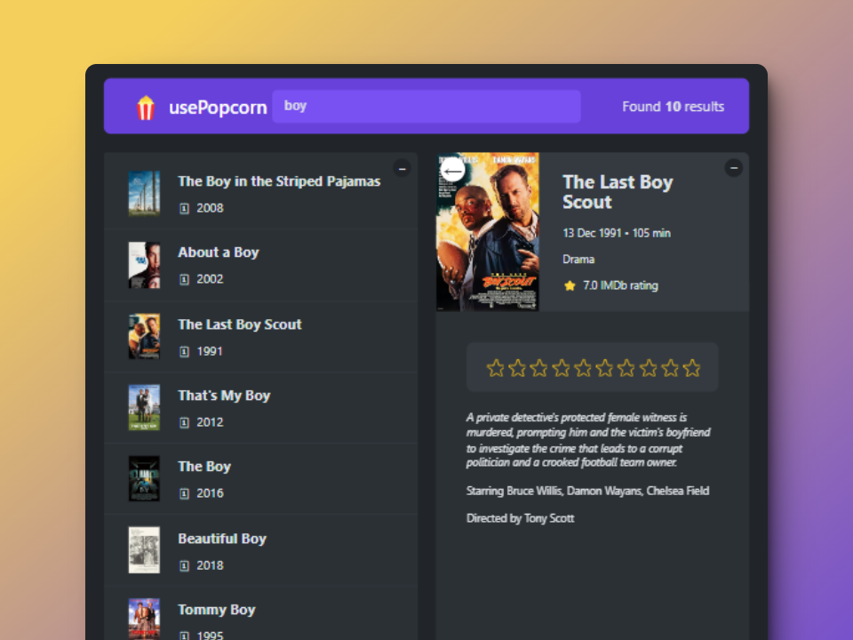

# usePOPCORN

This is a React project developed using [Create React App](https://github.com/facebook/create-react-app) as part of '[The Ultimate React Course 2024](https://www.udemy.com/course/the-ultimate-react-course/)' by Jonas Schmedtmann.

## What I learned

In this project, I build a movie search web app to further my understanding of React, covering topics such as:

- How to Split a UI Into Components
- Prop Drilling
- PropTypes
- useEffect
- The useEffect Dependency Array
- The useEffect Cleanup Function
- useRef
- Custom Hooks

### Screenshot

Here's a glimpse of the final project:



## Installation

To install the project, follow these steps:

1. Clone the repository:

```bash
git clone https://github.com/xyzeez/usepopcorn.git
```

2. Navigate to the project directory:

```bash
cd usepopcorn
```

3. Install dependencies:

```bash
npm install
```

4. Start the application:

```bash
npm start
```
